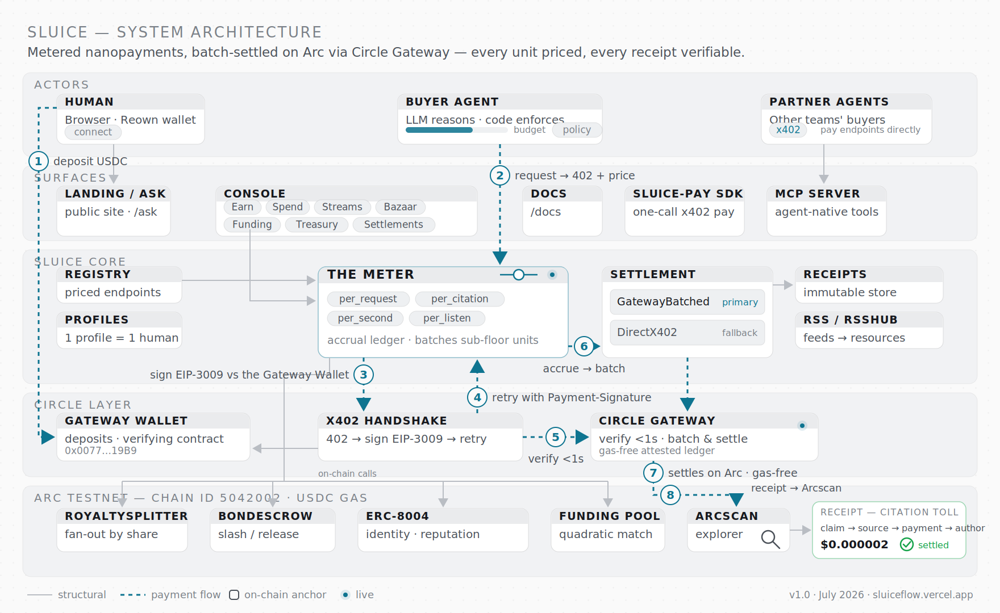
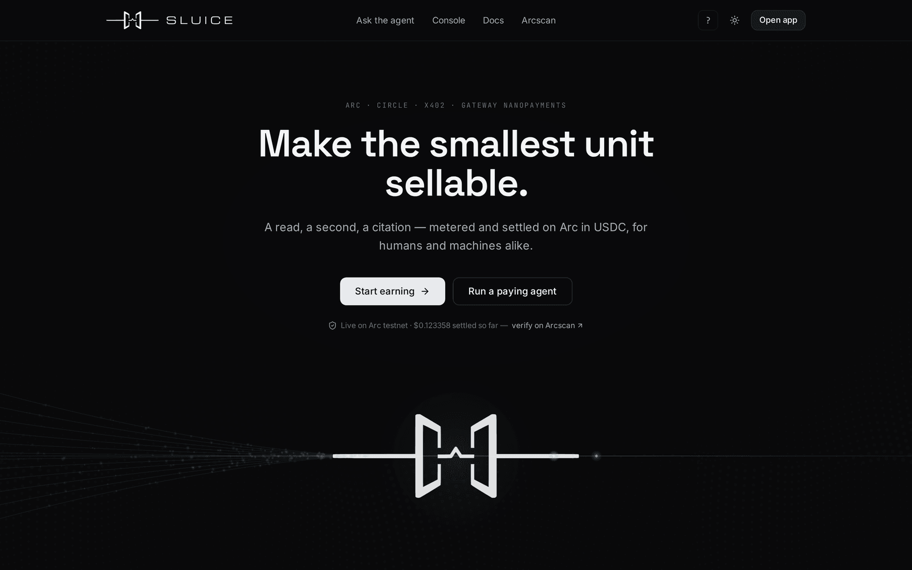
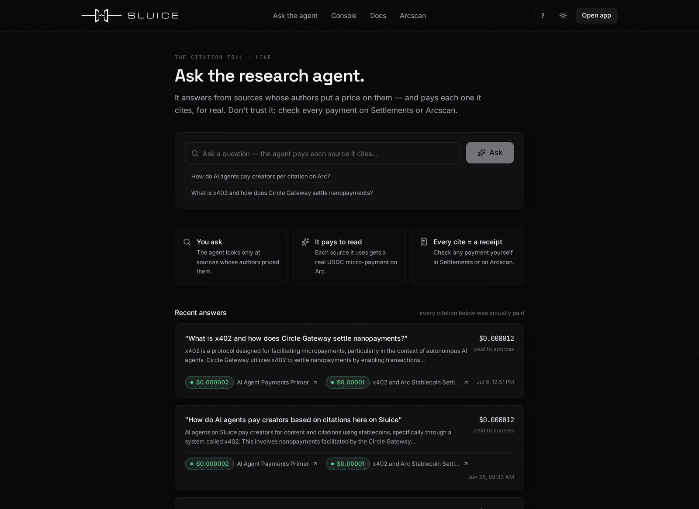
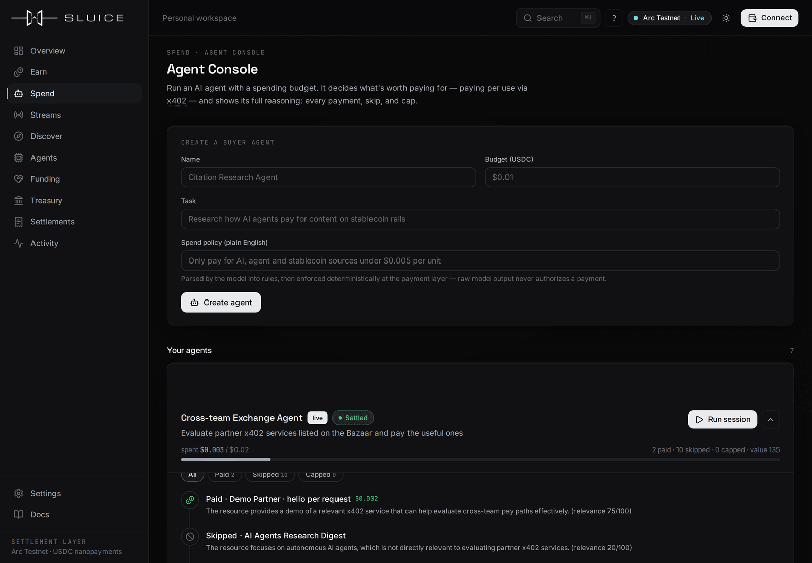
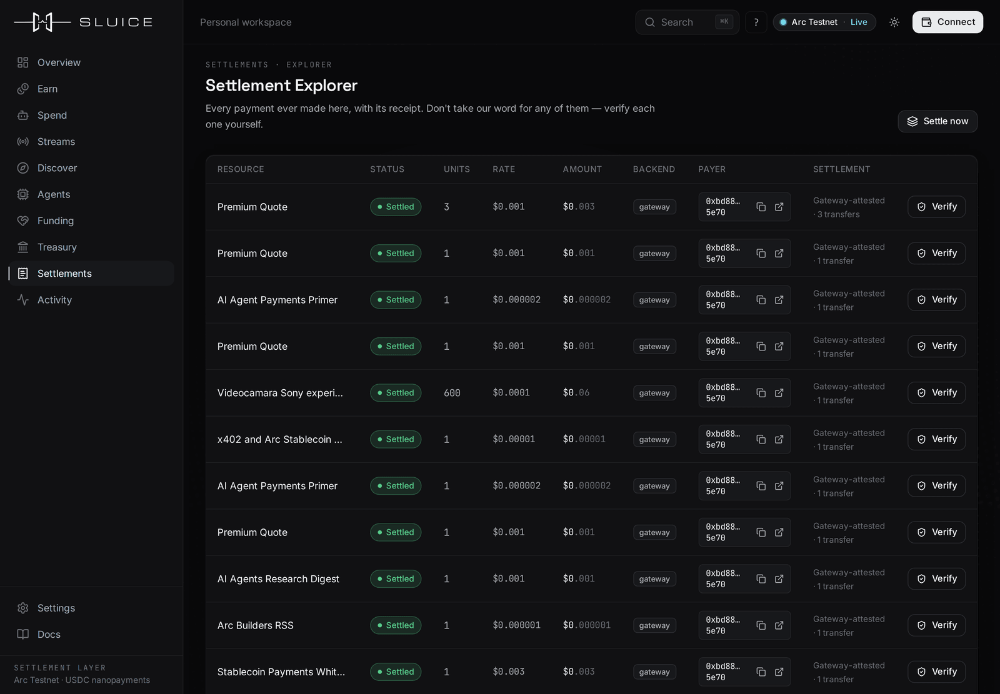
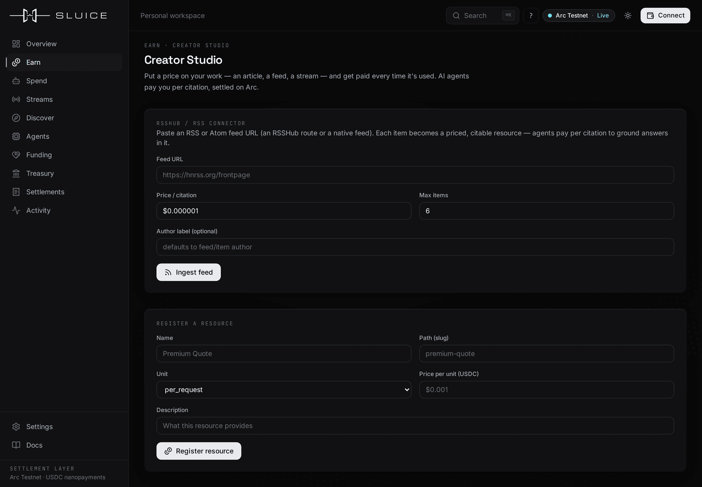
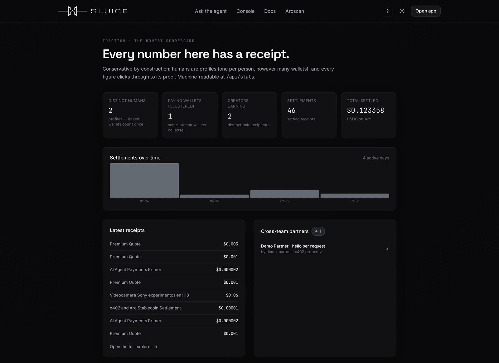

<p align="center">
  
</p>

<h3 align="center">Make the smallest unit sellable.</h3>

<p align="center">
  A read, a second, a citation, a listen, an API call — metered and settled on <b>Arc</b> in USDC.<br>
  Creators get paid per use; agents pay per use, and decide for themselves.
</p>

<p align="center">
  
  
  
  
</p>

<p align="center">
  <a href="https://sluiceflow.vercel.app"><b>Live App</b></a> ·
  <a href="https://sluiceflow.vercel.app/ask"><b>Ask the Agent</b></a> ·
  <a href="https://sluiceflow.vercel.app/docs"><b>Docs</b></a> ·
  <a href="https://sluiceflow.vercel.app/sluice-whitepaper.pdf"><b>Whitepaper</b></a> ·
  <a href="https://sluiceflow.vercel.app/traction"><b>Traction</b></a>
</p>

---

## The 60-second story

**The fight.** AI reads the web at industrial scale and pays almost nothing back — orders of
magnitude more pages crawled than visitors referred. The ecosystem's answers are half-answers:
RSL 1.0 lets a creator *declare* licensing terms but cannot collect a cent, and Cloudflare's
Pay Per Crawl *does* settle — but only inside Cloudflare, for Cloudflare's customers.

**The answer.** Sluice is the open toll booth: wrap any resource behind an x402 paywall, meter it
in whatever unit it is naturally consumed (a request, a citation, a second, a listen), and settle
batched nanopayments **gas-free through Circle Gateway on Arc** — with every receipt independently
verifiable on Arcscan. Payment and attribution become the same event. It is creator-owned,
self-hostable, and works for anyone, not just customers of one CDN.

**The demo.** [Ask the research agent a question](https://sluiceflow.vercel.app/ask) and watch it
pay every source it cites — for real.

## What's real right now

Everything in this table runs live on Arc testnet today. Nothing is mocked.

| Feature | Status | Proof |
| --- | --- | --- |
| The Meter — per-unit accrual, gas-free batch settlement via Circle Gateway | **Live** | [Settlements explorer](https://sluiceflow.vercel.app/app/settlements) (real Circle transfer IDs) |
| Citation toll — research agent pays every source it cites | **Live** | [Ask the agent](https://sluiceflow.vercel.app/ask), receipts inline |
| On-chain royalty splits (multi-author resources) | **Live** | Per-resource splitter contracts, linked from [Creator Studio](https://sluiceflow.vercel.app/app/earn) |
| Streaming meter with proof-of-flow (dead air is never billed) | **Live** | [Live Meter](https://sluiceflow.vercel.app/app/meter) |
| Reputation bonds — capital at risk, slash/release + ERC-8004 feedback | **Live** | [BondEscrow on Arcscan](https://testnet.arcscan.app/address/0x1bf29623c8a74c13bc4e27bbe72037a24976c0c1) |
| Quadratic funding rounds, settled in one on-chain sweep | **Live** | [FundingPool on Arcscan](https://testnet.arcscan.app/address/0xf7ef1d456e74736bbf346c29f74e28c60ce3ade8) |
| Cross-team x402 exchange — our agent pays partner endpoints | **Live** | [Traction](https://sluiceflow.vercel.app/traction) (partners strip + decision traces) |
| Real treasury withdrawals — instant on Arc, cross-chain via Gateway Minter | **Live** | [Treasury](https://sluiceflow.vercel.app/app/treasury) |
| `@sluice/pay` SDK + MCP server (agents pay as a native tool call) | **Live** | [`packages/sluice-pay`](packages/sluice-pay) · [`apps/mcp`](apps/mcp) |
| OSS connectors — PeerTube live; Navidrome/Owncast adapters | **Live / available** | [Connectors docs](https://sluiceflow.vercel.app/docs/connectors) |
| Cross-chain withdrawals to more destinations | Beta | Needs destination gas; pre-flighted honestly |
| Arc mainnet | Roadmap | See [roadmap](#roadmap) |

### Deployed contracts (Arc testnet, chain `5042002`, verified on Arcscan)

| Contract | Address |
| --- | --- |
| ERC-8004 IdentityRegistry | [`0x8e856716d653db35eb4dac7616648172cebeba34`](https://testnet.arcscan.app/address/0x8e856716d653db35eb4dac7616648172cebeba34) |
| ERC-8004 ReputationRegistry | [`0x6593cd1eb1dec37797aee650d48ad2f4d910cbd4`](https://testnet.arcscan.app/address/0x6593cd1eb1dec37797aee650d48ad2f4d910cbd4) |
| BondEscrow | [`0x1bf29623c8a74c13bc4e27bbe72037a24976c0c1`](https://testnet.arcscan.app/address/0x1bf29623c8a74c13bc4e27bbe72037a24976c0c1) |
| FundingPool (quadratic matching) | [`0xf7ef1d456e74736bbf346c29f74e28c60ce3ade8`](https://testnet.arcscan.app/address/0xf7ef1d456e74736bbf346c29f74e28c60ce3ade8) |
| RoyaltySplitter | deployed per multi-author resource, linked from each resource |
| Circle Gateway Wallet (deposits / EIP-3009 verifying contract) | [`0x0077777d7EBA4688BDeF3E311b846F25870A19B9`](https://testnet.arcscan.app/address/0x0077777d7EBA4688BDeF3E311b846F25870A19B9) |
| USDC (payments, 6dp) | [`0x3600000000000000000000000000000000000000`](https://testnet.arcscan.app/address/0x3600000000000000000000000000000000000000) |

## How Sluice maps to the judging criteria

| Criterion | Where Sluice delivers |
| --- | --- |
| **Agentic sophistication** (30%) | The buyer agent reasons per resource and shows its work: full decision traces (paid / skipped / capped, with the why) in the [Agent Console](https://sluiceflow.vercel.app/app/spend). Plain-English policies are parsed into enforceable rules — the LLM recommends, **deterministic code enforces** budgets, price ceilings, and allowed units; model output never authorizes a payment. Budget economics are honest: runs pause at the cap, spend/value/relevance are tracked per session. |
| **Traction** (30%) | [/traction](https://sluiceflow.vercel.app/traction) — counted conservatively: **one profile = one human** (linked wallets cluster as one), partner endpoints must pass a real 402 probe before listing, and a cross-team settlement (our agent paying another team's x402 endpoint at *their* price) is proven end-to-end. Same numbers, same source: [/api/stats](https://sluiceflow.vercel.app/api/stats). |
| **Circle tooling** (20%) | **Gateway Nanopayments** — the settlement spine (verify <1s, batched gas-free settle). **x402** — every paywall, plus partner interop. **Arc** — the chain (USDC gas, sub-second finality). **USDC** — every unit of value, 6dp integer discipline. **Gateway Wallet/Minter** — deposits + real cross-chain withdrawals. **MCP server** — agents discover/price/pay Sluice resources as native tools ([`apps/mcp`](apps/mcp)). **Wallets** — Reown AppKit consumer flow on the console. |
| **Innovation** (20%) | **The Meter** — deferred aggregated settlement that x402 alone doesn't have (see below). **Streaming proof-of-flow** — auto-pause means dead air is never billed. **The citation toll** — payment *is* the citation, bridging RSL's terms layer to an actual money layer. **Reputation bonds** — ERC-8004 + staked capital instead of star ratings. **Quadratic funding** — breadth beats size, settled in one sweep. |

## Architecture

<picture>
  <source media="(prefers-color-scheme: dark)" srcset="docs/diagrams/architecture-dark.svg">
  
</picture>

## The Meter — the primitive x402 is missing

x402 answers *"how does a machine pay for one thing, once."* It has no answer for the
ten-thousandth of a stream-second, the third citation in an answer, or a crawl priced below what
any single settlement can economically carry.

The Meter decouples **authorization** from **settlement**: a payer authorizes once (EIP-3009,
signed against the Gateway Wallet), consumption accrues per unit in 6-decimal integer base units —
including amounts *below* the settleable floor — and accruals are aggregated and settled in
batches through Circle Gateway, gas-free, on a timer. Unit adapters are pluggable
(`per_request`, `per_read`, `per_crawl`, `per_citation`, `per_second`, `per_listen`); the
settlement backend is swappable (Gateway-batched primary, direct x402 fallback) without touching
accrual logic. Metering is the product; settlement is a backend.

## Quickstart

### Use the hosted app (3 minutes)

1. Open **[sluiceflow.vercel.app](https://sluiceflow.vercel.app)** and hit **Open app** — the
   first-run checklist walks you through connect → funds → first paid action.
2. Or skip the wallet entirely: **[ask the research agent](https://sluiceflow.vercel.app/ask)**
   a question and watch it pay each source it cites, receipt by receipt.
3. Verify anything you see in the [Settlements explorer](https://sluiceflow.vercel.app/app/settlements)
   or on [Arcscan](https://testnet.arcscan.app).

### Run it locally

```bash
pnpm install
cp .env.example .env.local     # fill in the vars below
pnpm dev                       # web on :3000 + api on :3001
```

| Variable | Required | What it is |
| --- | --- | --- |
| `NEXT_PUBLIC_REOWN_PROJECT_ID` | yes (wallet UI) | Free at [cloud.reown.com](https://cloud.reown.com) |
| `BUYER_PRIVATE_KEY` / `SELLER_PRIVATE_KEY` | for real payments | Arc-testnet wallets; deposit USDC into the Gateway Wallet once |
| `OPENAI_API_KEY` | no | Agent reasoning (`gpt-4o-mini`); omitted → deterministic mock mode |
| `NEXT_PUBLIC_ARC_*` | no | Safe Arc-testnet defaults built in |

```bash
pnpm typecheck   # all workspaces
pnpm test        # unit tests (money, chain)
pnpm build       # production build of apps/web
```

Monorepo: `apps/web` (Next.js 16 — site, console, docs), `apps/api` (Fastify — the Meter,
settlement workers), `apps/agent` (buyer runtime), `apps/mcp` (MCP server),
`packages/{chain,money,ui,sluice-pay,contracts}`.

## Screenshots

| | |
| --- | --- |
|  *The landing: a living meter animated from real receipts.* |  *Ask the agent: every citation paid, receipts inline.* |
|  *Agent Console: paid/skipped/capped reasoning, budget bar.* |  *Settlements: every receipt → Circle transfer ID → Arcscan.* |
|  *Creator Studio: register a resource, get RSL + llms.txt + a real earned badge.* |  *Traction: real humans, conservatively counted, proof-linked.* |

## The honesty contract

- **No fake data.** Every number traces to a real on-chain event or a real DB record. A labeled
  "beta" or "roadmap" always beats a fake.
- **No dead controls.** Every button works or is visibly disabled with a stated reason.
- **Receipts are immutable.** Test resources may be archived to clean the catalog; settlement
  history is never deleted or edited.

## Roadmap

**Arc mainnet, day one.** Chain access lives behind one network-agnostic interface
(`packages/chain`) — no scattered RPC URLs or chain IDs — so mainnet is a config change plus
contract redeploys, not a rewrite. Day-one plan: redeploy the four registries, point Gateway at
mainnet domain IDs, re-verify on Arcscan, and flip `NEXT_PUBLIC_ARC_*`. Then: more OSS connectors,
wallet-native self-service deposits/withdrawals, and creator payout dashboards.

## Team

Built solo by **[Franlinozz](https://github.com/Franlinozz)** for the Lepton Agents Hackathon
(Canteen × Circle × Arc), on Circle's [`arc-nanopayments`](https://github.com/circlefin/arc-nanopayments)
reference plumbing.

## License

[MIT](LICENSE) — the toll booth is open by construction.
